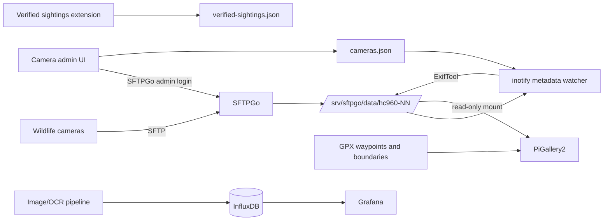

# Wildlife camera gallery stack

Reproducible reference setup for receiving wildlife-camera images with
SFTPGo, enriching new JPEG files with camera metadata, browsing them in
PiGallery2, marking verified animal sightings, showing named GPX waypoints,
and importing a Norwegian Grafana dashboard.

The repository contains no photos, credentials, user databases, or real camera
and hunting coordinates. The QR-code information page intentionally preserves
its already-public service URLs and contact text so it can be restored without
changing the physical camera labels. Keep repository access appropriately
restricted.

## What is included

- SFTPGo/PiGallery2 Compose examples and a deployment checklist.
- A systemd metadata watcher using ExifTool and inotify.
- A small camera administration UI. It authenticates against the existing
  SFTPGo administrator API and edits title, subject, comment, tags, position
  and enabled state for five camera folders.
- A PiGallery2 3.5.2 extension for the persistent logical album
  **Bekreftede observasjoner** (verified sightings).
- A PiGallery2 3.5.2 map overlay that reads GPX waypoint name, description,
  symbol and type, shows human-readable popups, and colors marker categories.
- An importable Norwegian Grafana dashboard using an InfluxDB/Flux datasource
  selected during import.
- The Caddy-hosted Norwegian camera-information page used by the physical QR
  codes.
- Sanitized configuration and GPX examples, backup guidance and recovery
  notes.

## Architecture



See [docs/architecture.md](docs/architecture.md) for the data flow and trust
boundaries.

## Known-compatible versions

The captured deployment used:

- Debian 13 containers
- SFTPGo 2.7.5 (native systemd service)
- PiGallery2 3.5.2 in Docker
- five folders named `hc960-01` through `hc960-05`
- PiGallery photo mount `/photos` -> `/app/data/images` (read-only)
- SFTPGo photo root `/srv/sftpgo/data`

The custom extension and map overlay are pinned to PiGallery2 3.5.2. Rebuild
and retest them before upgrading PiGallery2.

## Recreate the setup

1. Read [docs/install.md](docs/install.md) and prepare two hosts or containers:
   one writable SFTPGo host and one PiGallery2 host with read-only access to
   the same photo tree.
2. Install SFTPGo, create one restricted user/folder per camera, and verify
   each camera can upload only to its own directory.
3. Install the metadata services and camera UI with
   `sudo scripts/install-metadata-stack.sh`.
4. Deploy PiGallery2 using `compose/pigallery2/compose.yaml`, change the
   initial administrator password, then install the verified-sightings
   extension.
5. Optionally build the named/color GPX map image using
   `pigallery2-map/build.sh` and point `PIGALLERY_IMAGE` at the result.
6. Place a private production GPX file at the top of the photo tree. Use
   `gpx/example.gpx` as the schema, never as real coordinates.
7. Import `grafana/viltkamera-grafana-dashboard-no.json` and bind its datasource
   input to the desired InfluxDB 2.x Flux datasource.
8. Configure a reverse proxy/TLS for PiGallery2. Keep SFTPGo WebAdmin and the
   camera admin UI private.
9. Deploy `information-site/viltkamera.html` to `/var/www/html/` on the Caddy
   host. Preserve `https://8370.no/viltkamera.html` because physical camera QR
   codes point to it.

The official projects recommend Docker for PiGallery2 and provide both native
and containerized SFTPGo deployments:

- https://bpatrik.github.io/pigallery2/setup/docker/
- https://github.com/drakkan/sftpgo

## Backups that matter

Back up these independently:

- the entire photo tree (or storage snapshots)
- SFTPGo provider/config state and administrator/user records
- `/etc/viltkamera-metadata/cameras.json`
- PiGallery2 `config/` and `db/`
- `config/extensions/verified-sightings/verified-sightings.json`
- private production GPX files
- `/var/www/html/viltkamera.html` and the separately protected
  `grunneiertillatelse.jpg`
- reverse-proxy/Caddy and TLS configuration

`scripts/backup-state.sh` captures configuration/state, not the photo library.
See [docs/operations.md](docs/operations.md) for restore and upgrade procedure.

## Safety defaults

- Services bind to localhost unless explicitly changed.
- PiGallery receives photos read-only.
- New images are modified in place only by the SFTPGo-side metadata service.
- Existing photos are not backfilled automatically.
- Real coordinates and credentials are ignored by Git.
- Every upgrade should start with a snapshot and a restore test.

## Repository layout

```text
camera-admin/                  metadata configuration web UI
compose/pigallery2/            PiGallery2 deployment example
compose/sftpgo/                optional all-Docker SFTPGo example
docs/                          architecture, install, maps and operations
extensions/verified-sightings/ PiGallery logical album extension
gpx/example.gpx                fake-coordinate GPX schema example
grafana/                       Norwegian dashboard JSON
information-site/              Caddy-hosted QR-code information page
metadata/                      watcher and systemd service
pigallery2-map/                PiGallery2 3.5.2 overlay and build script
scripts/                       install, backup and validation helpers
```

## License

Project-owned code is MIT licensed. See [NOTICE.md](NOTICE.md) for upstream
PiGallery2 and Leaflet attribution. SFTPGo is a separate AGPL-3.0 project.
